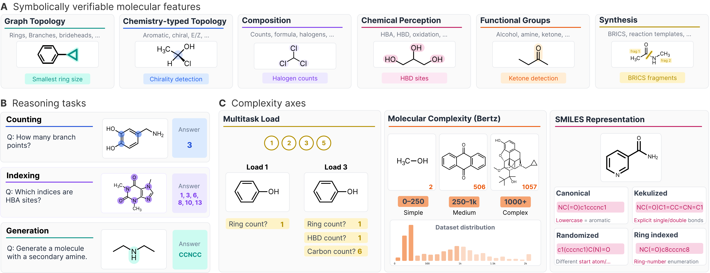

# MolecularIQ


<div align="center">

[](https://huggingface.co/spaces/ml-jku/molecularIQ_leaderboard)
[](https://openreview.net/pdf?id=RqwEzZqMFv)
[](https://github.com/ml-jku/moleculariq-benchmark)
[](https://github.com/ml-jku/moleculariq-eval)
[](https://github.com/ml-jku/moleculariqd)

*Characterizing Chemical Reasoning Capabilities Through Symbolic Verification on Molecular Graphs*

[Overview](#overview) • [Repositories](#moleculariq-repository-family) • [Citation](#citation)

</div>

## 🎯 Overview

Large Language Models are increasingly applied to chemistry, tackling tasks such as molecular name conversion, captioning, text-guided generation, and property or reaction prediction. A molecule's properties are fundamentally determined by its composition and structure, encoded in its molecular graph; thus, reasoning about molecular properties requires understanding and reasoning over the molecular structure.

Yet, most existing benchmarks emphasize general chemical knowledge, rely on literature or surrogate labels that risk leakage or bias, or reduce evaluation to multiple-choice questions.

**MolecularIQ** is a molecular structure reasoning benchmark focused exclusively on symbolically verifiable tasks. It enables fine-grained evaluation of reasoning over molecular graphs and produces capability fingerprints that localize model failures to specific tasks and molecular regimes.



### 🗝️ Key features
**Reasoning tasks**. MolecularIQ covers three categories of reasoning:
* **Counting**: Feature and substructure counting on molecular graphs
* **Indexing**: Index-based attribution of atoms, bonds, or substructures
* **Constrained generation**: Generation of valid molecules under structural constraints

**Three types of complexity axes**. MolecularIQ spans three orthogonal axes:
* Molecular complexity: Tests models across molecules of varying structural complexity.
* Multitask load: Evaluates performance across different amounts of reasoning requirements.
* SMILES representation: Tests robustness across different SMILES representations.


## 👨‍👧‍👦 MolecularIQ repository family

This repository serves as an entry point to the MolecularIQ ecosystem, covering the [benchmark dataset creation](https://github.com/ml-jku/moleculariq-benchmark), the [leaderboard](https://huggingface.co/spaces/ml-jku/molecularIQ_leaderboard), the [evaluation procedure with lm-eval-harness](https://github.com/ml-jku/moleculariq-eval), and the dynamic version [MolecularIQD](https://github.com/ml-jku/moleculariqd).

| Repository | Purpose | 
|------------|---------|
|📍 **[moleculariq](#moleculariq)** | Current repo, overview over different MolecularIQ code bases|
| **[moleculariq-leaderboard](https://huggingface.co/spaces/ml-jku/molecularIQ_leaderboard)** | Leaderboard: HuggingFace space, displays results, handles submissions |
| **[moleculariq-core](https://github.com/ml-jku/moleculariq-core)** | Shared library providing core functionality, e.g. symbolic verifiers and question formatting | 
| **[moleculariq-benchmark](https://github.com/ml-jku/moleculariq-benchmark)** | Dataset creation: task definitions, symbolic verifiers implementations, question generator| 
| **[moleculariq-eval](https://github.com/ml-jku/moleculariq-eval)** | Evaluation code: integration with lm-eval-harness, model configs, reward functions, extraction functions, and system prompts|
|**[moleculariqd](https://github.com/ml-jku/moleculariqd)**| Dynamic MolecularIQ version: includes molecule pools from which questions/samples can be created and evaluated on the fly| 

## Citation

If you use MolecularIQ in your research, please cite:

```bibtex
@article{...,
  title={MolecularIQ: Characterizing Chemical Reasoning Capabilities Through Symbolic Verification on Molecular Graphs},
  ...
}
```


---

<div align="center">

**[⬆ Back to Top](#moleculariq)**

</div>